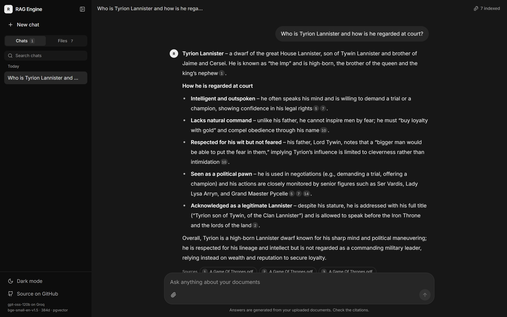
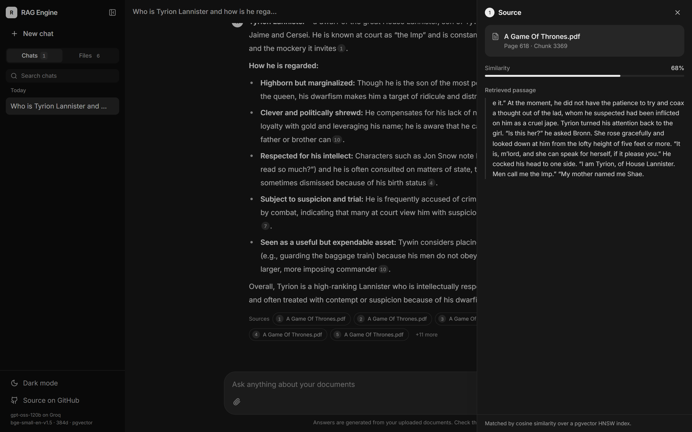
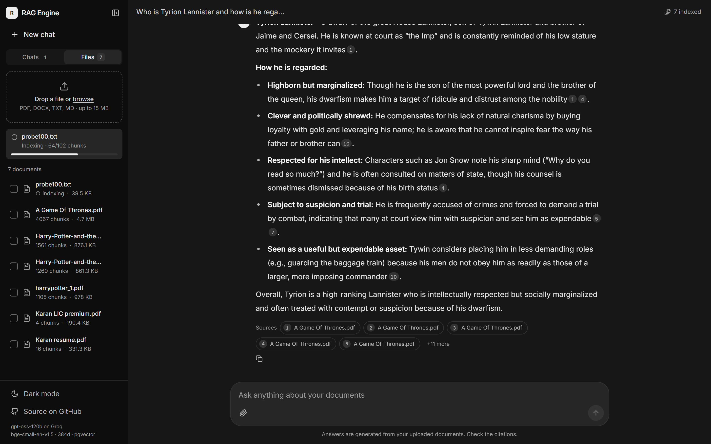
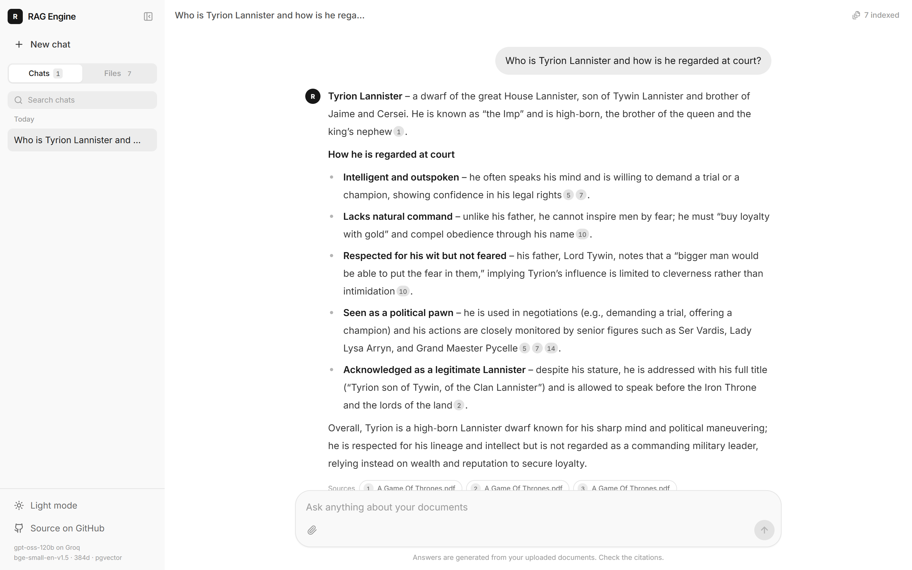
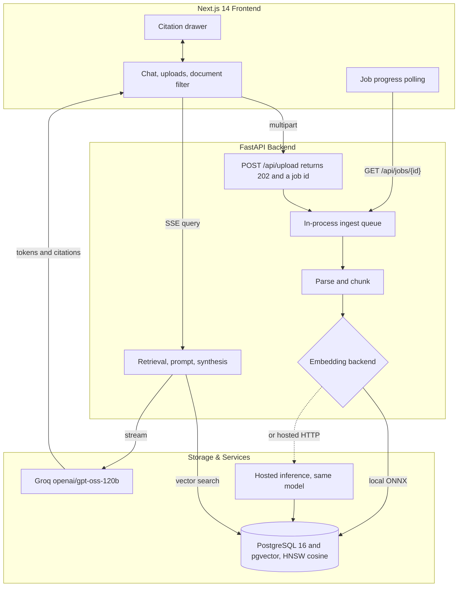

# RAG Document Search & Synthesis Engine

[](https://fastapi.tiangolo.com/)
[](https://github.com/qdrant/fastembed)
[](https://github.com/pgvector/pgvector)
[](https://groq.com/)
[-000000?logo=nextdotjs)](https://nextjs.org/)

Upload your documents and ask questions about them. Answers are synthesised only from what you uploaded, with inline citations that open the exact passage the claim came from.

**Live:** [rag-powered-ai-search-and-synthesis.vercel.app](https://rag-powered-ai-search-and-synthesis.vercel.app)

---

## Screenshots

Answers are built from the documents and cite them inline. Every `[n]` badge is clickable.



Clicking a citation opens the passage that produced the claim, with its page, chunk index and cosine similarity — so an answer can always be checked against the source rather than taken on trust.



Indexing runs in the background. Uploads return immediately and report progress per document, so a large file does not block the interface.



Light and dark themes.



---

## How it works



**Retrieval adapts to the shape of the question.** A specific factual lookup uses a narrow top-k. "Who is X" widens to 16 passages, because no single chunk defines a character or concept — a characterisation has to be built from many mentions. Enumerative questions ("list all…") widen further.

---

## Engineering notes

The parts of this project that were actually difficult, and what the fixes were.

### Chunking was silently poisoning retrieval

Asking "who is Hermione" returned:

> Hermione is a character who speaks in the passages, for example saying "the passage!" and "What's the matter, Lavender?"

The model was not at fault. PDF pages were chunked in isolation with a fixed stride, so every page shed a runt tail and prose crossing a page break was cut mid-sentence. Chunks as short as **6 characters** were reaching the index.

Those runts then *won* retrieval: a 32-character chunk containing "Hermione" is almost entirely "about" Hermione by cosine similarity, while a rich 500-character chunk dilutes the signal. The five worst possible chunks were being selected.

Pages are now flattened into one continuous stream with an offset→page map (so citations still report the right page), the stride steps from where each chunk actually ended, and short tails merge into the previous chunk. Re-ingesting the corpus removed **386 junk fragments** and left zero chunks under 120 characters. The same question now returns a real characterisation drawn from 16 passages, the shortest of which is 493 characters.

A query-time filter also drops low-information fragments, so documents indexed before the fix benefit without re-ingesting.

### Embedding is 96% of ingest, and that made hosting it impossible

| Stage | Share of ingest time |
|---|---|
| Parse 753 pages | 4% |
| Embed 4067 chunks | **96%** |

Embedding is a neural network forward pass over every chunk — roughly **34 TFLOP** for one 4.7MB PDF. On a 0.1 vCPU host that is about 12 hours, and the process gets OOM-killed long before finishing. No amount of batching or thread tuning changes it; the FLOPs are the constraint.

`EMBEDDING_BACKEND` now selects where that work happens:

| | `local` | `hosted` |
|---|---|---|
| Throughput | 7.7 chunks/s | **91.3 chunks/s** |
| CPU (256 chunks) | one core, saturated | **0.1s total** |
| Resident memory | ~200 MB | **~60 MB** |
| Query latency | 50 ms | 290 ms |

The hosted backend deliberately calls the **same model id**, not a vendor's alternative. Identical weights mean an identical vector space, so nothing already indexed has to be re-embedded — verified rather than assumed: hosted vectors compared against rows already stored in pgvector agree to a cosine of **0.999998**. Had that come back lower, switching backends would have silently degraded every existing document instead of failing loudly.

Result on the free tier that previously could not ingest at all: a 4.7MB, 753-page PDF now indexes in **150 seconds**, peaking at 109 MB against a 512 MB limit.

### Reusing my own job-processing system

Ingesting a book takes minutes. Doing that inside the upload request meant holding an HTTP connection open the whole time, so a dropped connection or proxy timeout lost the work — and a failure part-way left a document row behind holding only the chunks that made it in. That is how the deployed instance kept accumulating documents stuck at zero chunks.

Rather than designing that from scratch, the job model here is taken from **[DocFlow](https://github.com/Karan67/DocFlow)**, a document job-processing system I built separately: a queue, explicit pipeline stages, per-job progress, and a reaper for work orphaned by a dead process.

DocFlow itself runs Celery with Redis and S3-compatible storage. That is the right design when you can run a worker — but the free tier this deploys to offers no background workers at all, so this app implements the same model with a single in-process worker draining an `asyncio` queue: no broker, no second service, no extra hosting. The trade-offs are handled rather than ignored — the queue depth is capped because queued files sit in memory, and jobs interrupted by a restart are marked failed with their partial documents discarded, since a truncated document answers queries from a fraction of its content while looking complete.

The exchange went both ways: DocFlow gained the same pluggable hosted-embedding backend ([PR #8](https://github.com/Karan67/DocFlow/pull/8)), since its workers face exactly the same CPU wall.

Uploads now return **202 in 0.12s** instead of holding a connection for 92 seconds.

### Answers that fit the token budget

Groq's free tier caps requests at 8,000 tokens per minute, counting prompt **plus** `max_completion_tokens` in full — whether or not the reply uses it. Wide retrieval plus a 4096-token reply budget exceeded that on every broad question, so they failed outright.

Reply budgets are now per-tier: narrow questions keep the full budget, widened tiers request less. Retrieval width is unchanged. Answers cut short by the cap are detected via `finish_reason` and labelled, rather than stopping mid-sentence with no explanation.

---

## Quick start

```bash
cp .env.example .env      # add your GROQ_API_KEY
docker compose up --build
```

- Frontend — http://localhost:3000
- API docs — http://localhost:8000/docs

The stack is Postgres 16 + pgvector, the FastAPI backend, and the Next.js frontend. The schema is created on first boot.

### Configuration worth knowing

| Variable | Default | Why |
|---|---|---|
| `EMBEDDING_BACKEND` | `local` | `hosted` moves embedding off the box. Needed on CPU-starved hosts. |
| `EMBED_API_TOKEN` | — | Required when `EMBEDDING_BACKEND=hosted`. |
| `EMBEDDING_THREADS` | 8 (compose) | ONNX thread cap. Measured 2.5× faster than 4 on a 12-core host; the code default stays at 4 for small hosts. |
| `CHUNK_SIZE` / `CHUNK_OVERLAP` | 500 / 100 | Overlap keeps facts that straddle a boundary intact. |
| `INGEST_QUEUE_SIZE` | 4 | Queued uploads hold bytes in memory; full returns 503 rather than an OOM. |
| `CORS_ORIGINS` | localhost:3000 | Must match the deployed frontend exactly, or the browser blocks every request. |

---

## API

### Documents
- `POST /api/upload` — queue a document. Returns **202** with an ingest job; indexing continues in the background.
- `GET /api/documents` — all indexed documents.
- `DELETE /api/documents/{id}` — delete a document and cascade its vectors.

### Ingest jobs
- `GET /api/jobs/{id}` — status (`queued` → `parsing` → `embedding` → `completed` | `failed`), chunk progress, error.
- `GET /api/jobs` — jobs still running, so a reloaded page resumes tracking.

### Search
- `POST /api/query/stream` — SSE. Emits a `citations` event first, then `token` events, then `done`.
- `POST /api/query` — same, non-streaming.

### System
- `GET /health` — database and API status.

---

## Layout

```text
backend/app/
├── main.py                      FastAPI routes
├── config.py                    all tunables
└── services/
    ├── ingest.py                background ingest queue + worker
    ├── parser.py                parsing and chunking
    ├── embedding_provider.py    local ONNX / hosted HTTP backends
    ├── vector_store.py          embedding entry points
    ├── db.py                    asyncpg, vector search, job store
    └── rag_engine.py            retrieval, prompting, Groq synthesis

frontend/src/
├── app/page.tsx                 state, job polling
├── components/
│   ├── Sidebar.tsx              chats / files tabs
│   ├── DocumentPanel.tsx        upload, job progress, document list
│   ├── ChatView.tsx             message feed, landing state
│   ├── Composer.tsx             prompt input, attach, doc filter
│   ├── MessageBubble.tsx        markdown + citation badges
│   └── CitationDrawer.tsx       retrieved passage
└── lib/api.ts                   API client
```

---

## Deployment

Runs on free tiers: **Supabase** (Postgres + pgvector), **Render** (backend), **Vercel** (frontend).

Two things that are easy to get wrong:

- Supabase's **direct** connection string resolves to IPv6 only. Hosts without IPv6 egress — Render among them — cannot reach it. Use the **Session Pooler** string.
- Set `EMBEDDING_BACKEND=hosted` on any host with a fraction of a CPU. Without it, ingesting anything larger than a small file will fail.
